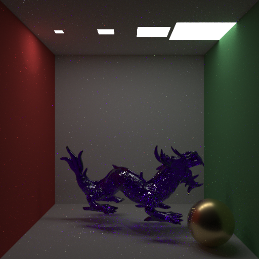
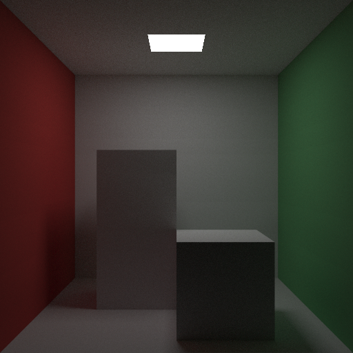
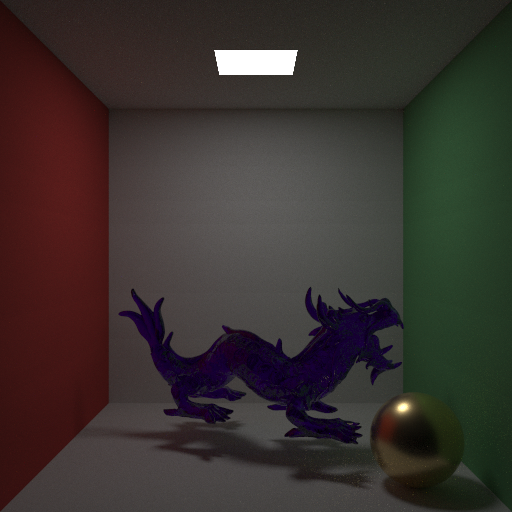

# nanopt

A from-scratch spectral path tracer in C++. Light transport is computed per-wavelength across the visible range (380–750 nm), not as RGB. The "nano" is grounded: nanometers.



## What's distinctive

Each path samples 5 wavelengths (one hero + four stratified secondaries) across 380–750 nm. Scene-time RGB literals are upsampled to spectra at evaluation time (Smits 1999); per-wavelength radiance integrates to CIE 1931 XYZ via Wyman 2013 analytic matching curves before mapping to D65-white linear sRGB on output. The payback for the spectral scope is dispersion (rainbow through glass), with iridescence and fluorescence accessible from the same pipeline.

No Embree, no OpenImageDenoise, no third-party BSDF or sampling library. The path tracer is derived from first principles; CMake is the only piece of infrastructure that isn't.

## Features

- **Geometry** — spheres, triangles, OBJ meshes with positions and per-vertex normals; flat or smooth shading via face-forward-clamped barycentric interpolation.
- **Acceleration** — SAH-built BVH; flat node array, ray-AABB slab traversal.
- **Materials**
  - *Lambertian* — RGB albedo, Smits-upsampled per evaluation.
  - *Rough conductor* — GGX D × height-correlated Smith G2 × per-wavelength complex Fresnel against measured η/κ tables (Au, Cu, Al; McPeak et al. 2015). Sampled via the GGX VNDF construction.
  - *Smooth dielectric* — perfect specular reflect/refract with wavelength-dependent IOR (Sellmeier 3-term; BK7 and SF10 ship). The refract branch is dispersive: it samples the hero direction only and terminates the secondary wavelengths for the rest of the path.
- **Lighting** — diffuse triangle area lights and delta point lights.
- **Direct lighting** — Veach two-strategy MIS: light-strategy NEE plus BSDF-strategy continuation, combined with the power-2 heuristic. Delta BSDFs route light through the BSDF strategy alone, so emitters refract through glass correctly.
- **Path tracer** — Russian-roulette-terminated multi-bounce GI, depth limit, throughput-based continuation probability.
- **Output** — PPM (P6, 8-bit, gamma-encoded).

## Build

Requires CMake 3.25+ and a C++20 compiler.

```sh
cmake -B build
cmake --build build --config Release
```

Run the resulting `nanopt` binary from the project root so it can find `assets/cornell-box.obj`. Output is written to `out.ppm` in the working directory.

## Reference renders

The Cornell box at every spectral milestone, kept as a visual regression baseline:

| | |
|---|---|
|  |  |
| **RGB path tracing baseline.** | **Same scene through the spectral pipeline** (5-wavelength sampling, Smits upsample, CIE → sRGB). Matches the RGB baseline to ±6/255 per channel on neutral materials. |
|  |  |
| **Stanford XYZ RGB Dragon in SF10 glass.** Visible chromatic dispersion through the body. | **Direct-lighting MIS demo.** Equal-flux ceiling lights at decreasing size; small lights favour light sampling, large lights favour BSDF sampling, MIS picks per pixel. |

## Roadmap

Tile-based parallel rendering, EXR output, and prose documentation of the underlying math — light transport equation, spectral pipeline, BVH layout, BRDF reference.

## Acknowledgements

- **Stanford XYZ RGB Dragon** — Stanford 3D Scanning Repository (http://graphics.stanford.edu/data/3Dscanrep/). Distributed via the [common-3d-test-models](https://github.com/alecjacobson/common-3d-test-models) collection.
- **Conductor optical constants** — K. M. McPeak, S. V. Jayanti, S. J. P. Kress, S. Meyer, S. Iotti, A. Rossinelli, D. J. Norris, *"Plasmonic films can easily be better: Rules and recipes,"* ACS Photonics 2:326-333 (2015). Tables resampled from the CC0 data hosted at [refractiveindex.info](https://refractiveindex.info).

## License

MIT — see [LICENSE](LICENSE).
